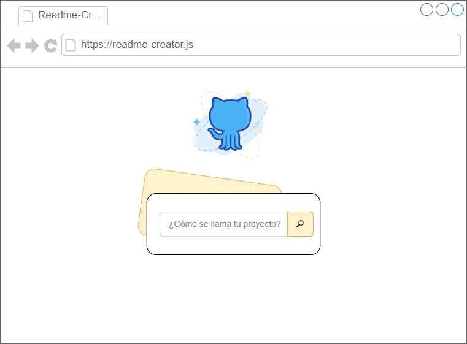
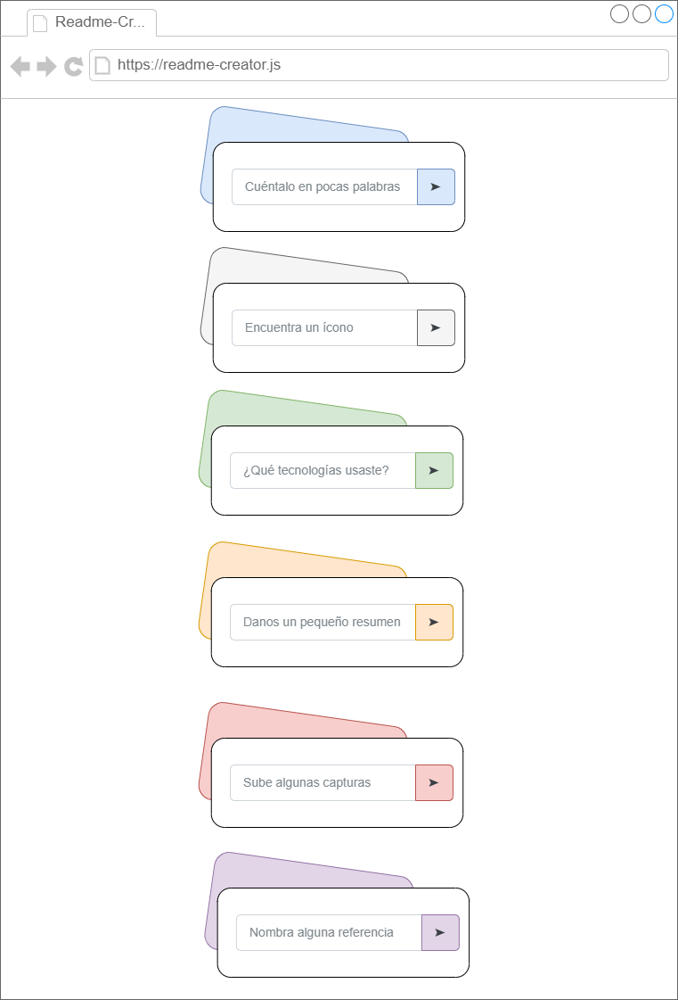

<p align="center">
  </img>
</p>

<div align="center">

# Readme Creator online

[](https://www.djangoproject.com/)
[](https://github.com/open-wc)

</div>

## Quickstart

To get started:

```bash
npm install
# requires node 10 & npm 6 or higher
```

## Scripts

- `start` runs your app for development, reloading on file changes
- `start:build` runs your app after it has been built using the build command
- `build` builds your app and outputs it in your `dist` directory
- `test` runs your test suite with Web Test Runner
- `lint` runs the linter for your project
- `format` fixes linting and formatting errors


## Capturas de pantalla

<div align="center">
  <a href="https://marfullsen.github.io/" rel="noopener">
  </a>
</div>

<div align="center">
  <a href="https://marfullsen.github.io/" rel="noopener">
  </a>
</div>

## References

- [Open WC Guide](https://open-wc.org/guides/)
- [HTML Arrow Symbol, Arrow Entity](https://www.toptal.com/designers/htmlarrows/arrows/)